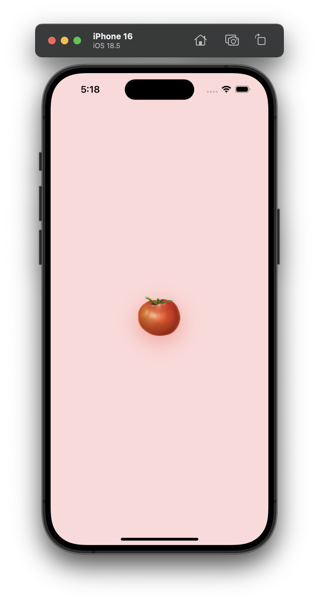
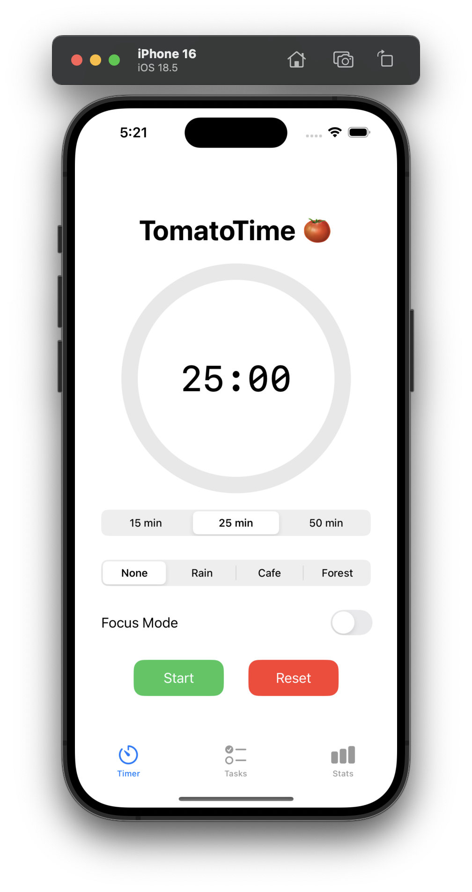
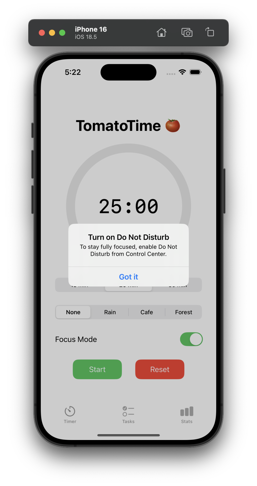
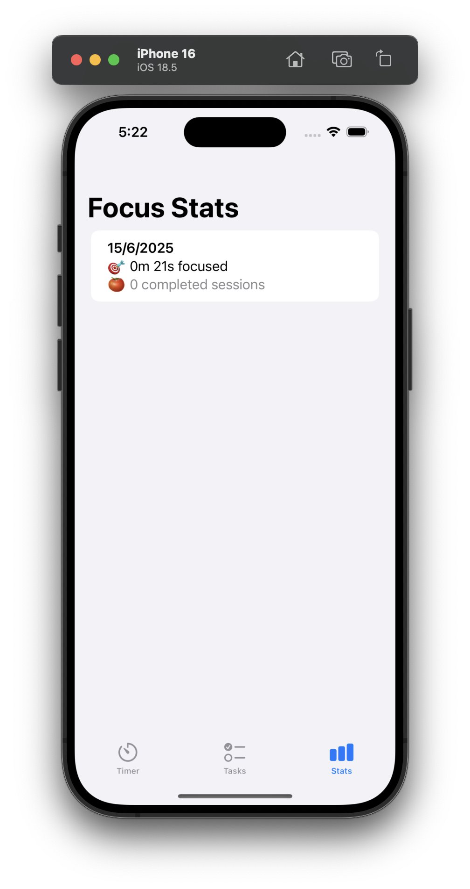
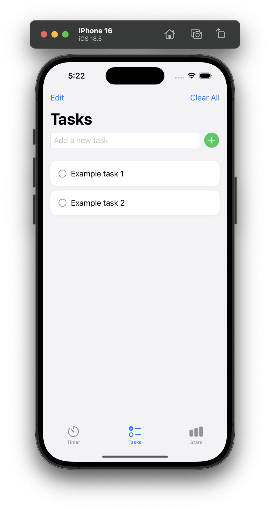

# TomatoTime 🍅

**TomatoTime** is a beautifully designed Pomodoro timer app for iOS, crafted using SwiftUI. It features ambient sounds, focus mode, real-time stats tracking, and a sleek animated splash screen.

---

## 🎯 Features

* ⏱️ Customizable Pomodoro durations (15, 25, 50 minutes)
* 🎧 Ambient sound picker (Rain, Café, Forest)
* 🍅 Animated splash screen with a smooth transition
* 🔕 Focus Mode with overlay and Do Not Disturb reminder
* 📊 Stats View: Tracks time focused and completed sessions
* 📝 Simple drag-and-drop To-Do list to plan tasks
* 🧠 Session data stored locally (via `UserDefaults`)

---

## Screens

| Splash                  | Timer                  | Focus Overlay          | Stats                  | To-Do                  |
| ----------------------- | ---------------------- | ---------------------- | ---------------------- | ---------------------- |
|  |  |  |  |  |

---

## Project Structure

```
TomatoTime/
├── PomodoroTimer.swift          # Core logic & timer engine
├── TimerView.swift              # Main UI for the session
├── SplashView.swift             # Launch animation screen
├── StatsView.swift              # Daily session logs
├── ToDoView.swift               # Task manager with drag & drop
├── ReusableComponents/
│   ├── TitleHeader.swift
│   ├── ProgressRing.swift
│   └── ActionButton.swift
```

---

## How to Customize

### 🕓 Change Session Durations

Modify the values in the Picker inside `TimerView.swift`.

```swift
Picker("Duration", selection: $timer.sessionDuration) {
    ForEach([15, 25, 50], id: \.“self”) { ... }
}
```

### 🎥 Add Your Own Ambient Sounds

1. Drag your `.mp3` file into Xcode’s Assets
2. Name it something like `ocean.mp3`
3. Add it to the Picker list:

```swift
ForEach(["None", "Rain", "Cafe", "Forest", "Ocean"], id: \.“self”)
```

### Tweak the Splash Screen

Edit `SplashView.swift` to change the emoji, timing, or background color.

---

## License

This project is licensed under the MIT License — see [LICENSE](./LICENSE) for details.

---

